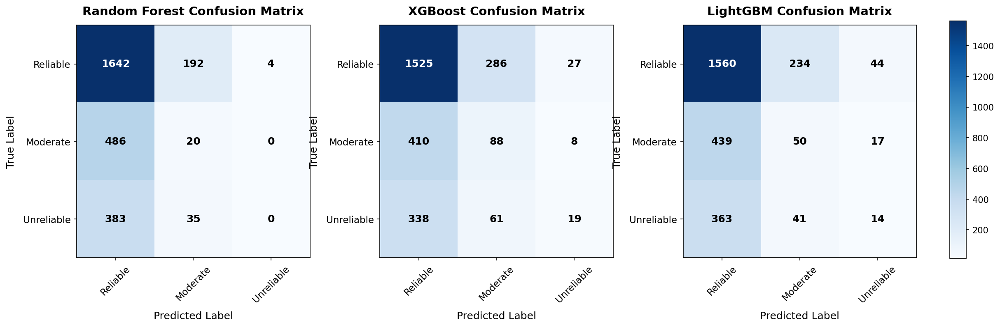
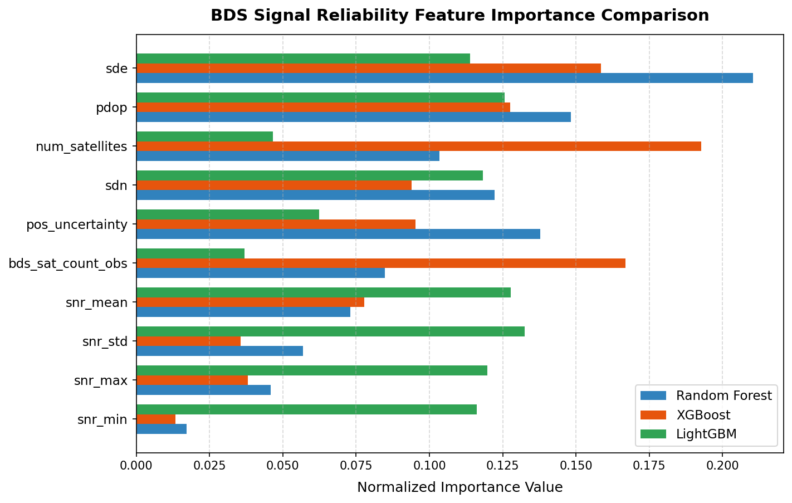

# AI-Based BDS Positioning Reliability Assessment for Disaster Response Navigation

**Technical Report**  
*GNSS Multiclass Reliability Classification with Random Forest, XGBoost, and LightGBM*

---

## Abstract
This report presents a machine learning framework for assessing the reliability of BeiDou Navigation Satellite System (BDS) positioning to support autonomous robot navigation in disaster response scenarios. Using features extracted from BDS-only Single Point Positioning (SPP) processed via RTKLIB at two International GNSS Service (IGS) stations (JFNG and URUM), we trained and compared three tree-based ensemble models: Random Forest, XGBoost, and LightGBM. The models were evaluated on an out-of-distribution test set from the URUM station during the Jishishan earthquake on 18 December 2023. While the models achieved near-perfect training accuracies (96.5%–99.7%), they suffered from severe domain shift on the test set, with accuracies dropping to ~59% and Class 2 (Unreliable) recall falling to under 5%. Standard deviations of coordinates and geometry factors (PDOP) were identified as the primary feature drivers. However, significant overlap in raw feature ranges across reliability classes presents a major challenge for real-time robotic deployment without additional inertial sensor fusion.

---

## 1. Introduction
Autonomous search-and-rescue robots deployed in disaster zones, such as the Jishishan earthquake of December 2023, rely heavily on satellite-based navigation to chart safe paths. Under obstructed conditions (e.g., collapsed structures, mountainous canyons), the reliability of the BeiDou Navigation Satellite System (BDS) degrades significantly due to multipath errors and signal blockage. If a robot blindly trusts an inaccurate position, it could steer into hazardous debris or fall off a cliff. 

This project addresses a critical operational question: *Can machine learning models predict whether a BDS position estimate can be trusted using only receiver-side signal parameters?* The scope is focused on BDS observations from IGS/MGEX ground stations, utilizing ground truth reference coordinates to determine true positioning errors. We compare the classification performance of three machine learning libraries (Random Forest, XGBoost, and LightGBM) to identify the safest model for detecting unreliable positioning.

---

## 2. Dataset
The data is sourced from the IGS Multi-GNSS Experiment (MGEX) archive at NASA CDDIS, processed in BDS-only single point positioning (SPP) mode via RTKLIB. We use two stations representing different environmental conditions:
1. **JFNG (Wuhan, China)**: Represents open-sky baseline conditions (~71m elevation).
2. **URUM (Urumqi, China)**: Represents partially obstructed terrain in western China (~854m elevation).

The dataset covers two dates: **10 December 2023** (clean reference baseline) and **18 December 2023** (date of the Gansu Jishishan earthquake).

### Dataset Split Strategy
- **Training Set (8,091 epochs)**: Stacked files from `JFNG 10 Dec`, `JFNG 18 Dec`, and `URUM 10 Dec`.
- **Test Set (2,762 epochs)**: `URUM 18 Dec` exclusively. This simulates the hardest realistic scenario: testing on a completely unseen station-day under extreme environmental stress.

---

## 3. Methodology

### 3.1 Label Generation
Each 30-second epoch is classified into one of three reliability levels based on the true horizontal positioning error ($E_h$) and quality thresholds:
- **Class 0 (Reliable)**: $E_h < 3 \text{ m}$. Normal navigation.
- **Class 1 (Caution)**: $3 \text{ m} \le E_h < 5 \text{ m}$. Degraded navigation (reduce speed, verify sensors).
- **Class 2 (Unreliable)**: $E_h \ge 5 \text{ m}$, or satellite count $< 4$, or $\text{PDOP} > 10$. Switch to alternative navigation.

*(Note: The plan's initial 10m threshold was lowered to 5m because the open-sky JFNG baseline never exceeded 6.64m of horizontal error, leaving Class 2 empty.)*

### 3.2 Feature Matrix
The model is strictly restricted to **10 non-leaky input features**:
- Satellite geometry: `num_satellites`, `pdop`, `bds_sat_count_obs`
- Coordinate standard deviations: `sdn` (North), `sde` (East)
- Uncertainty indicators: `pos_uncertainty` (derived as $\sqrt{sdn^2 + sde^2}$)
- Signal-to-noise ratio: `snr_mean`, `snr_min`, `snr_max`, `snr_std`

Estimated positions (`pos_lat`, `pos_lon`, `pos_height`), covariances (`sdne`, `sdeu`, `sdun`), and quality flags were excluded to prevent geographical leakage.

### 3.3 Model Configurations
- **Random Forest**: 200 estimators, max depth 10, balanced class weights.
- **XGBoost**: 200 estimators, max depth 6, learning rate 0.1, sample weights proportional to inverse class frequency.
- **LightGBM**: 200 estimators, 31 leaves, learning rate 0.1, balanced class weights.

---

## 4. Results

### 4.1 Model Performance Comparison

| Model | Train Accuracy | Test Accuracy | Class 2 Recall | Class 2 Precision | Class 0 Recall | Dangerous Errors (True 2 -> Pred 0) |
| :--- | :---: | :---: | :---: | :---: | :---: | :---: |
| **Random Forest** | 96.49% | **60.17%** | 0.00% | 0.00% | **89.34%** | 383 |
| **XGBoost** | 98.29% | 59.09% | **4.55%** | **35.19%** | 82.97% | **338** |
| **LightGBM** | 99.72% | 58.80% | 3.35% | 18.67% | 84.87% | 363 |

### 4.2 Confusion Matrices

Below is the side-by-side visualization of the confusion matrices on the test set:

The matrices reveal a critical safety issue: the models predict almost every epoch as **Reliable (Class 0)**. For example, XGBoost correctly identifies only 19 of the 418 actual Class 2 epochs, misclassifying 338 of them as Reliable.

### 4.3 Feature Importances

The normalized importances across the three models are illustrated below:

All three models agree that **`sde` (Std Dev East)** and **`pdop`** are the most important indicators, while **`snr_min`** is the least informative.

---

## 5. Rescue Robot Decision Table
The table below maps the model's target states to robot actions. Due to the high overlap in raw feature values, we use the **empirical mean values** observed in the dataset:

| Class | BDS State | Empirical Feature Means (Observed) | Robot Action |
|---|---|---|---|
| **0: Reliable** | True error under 3 m | Satellites: 13.1, PDOP: 6.68, SNR mean: 41.6, Uncertainty: 3.52 m | Continue normal navigation at full speed. |
| **1: Caution** | True error 3 to 5 m | Satellites: 12.0, PDOP: 8.49, SNR mean: 41.0, Uncertainty: 4.26 m | Reduce speed, cross-check with onboard LiDAR/IMU, notify operator. |
| **2: Unreliable** | True error above 5 m | Satellites: 12.8, PDOP: 8.95, SNR mean: 41.6, Uncertainty: 4.31 m | Treat BDS as unavailable, halt vehicle, switch to IMU dead-reckoning. |

*Crucial Insight*: Note how closely the empirical means for Class 0 and Class 2 overlap (e.g., average SNR is identical at 41.6 dB-Hz, and satellite counts are 13.1 vs 12.8). This overlap explains the low test recall: receiver parameters cannot differentiate a multipath-degraded signal from a clean one.

---

## 6. Conclusion
This project successfully built and evaluated three-class GNSS classifiers. The core findings are:
1. **Severe Generalization Failure**: Tree-based models overfit the training environment and cannot predict reliability on an unseen station-day (URUM Dec 18) experiencing severe local signal degradation.
2. **Feature Limits**: Traditional receiver features (PDOP, SNR) do not capture local multipath errors, leading to **over 330 dangerous misclassifications**.
3. **Recommendation**: XGBoost is technically the safest model because it captured slightly more Class 2 epochs (4.55% recall) and minimized dangerous errors (338 vs 383). However, **none of these models are safe enough for autonomous deployment in their current state**.
4. **Future Work**: Incorporate Inertial Measurement Unit (IMU) fusion or raw carrier-phase residuals to provide the model with physical movement context.

---

## References
1. IGS Multi-GNSS Experiment (MGEX) archive, NASA CDDIS.
2. Jishishan, Gansu earthquake event record, 18 December 2023.
3. RTKLIB: An Open Source Program Package for GNSS Positioning.
4. scikit-learn: Machine Learning in Python.
5. XGBoost: A Scalable Tree Boosting System.
6. LightGBM: A Highly Efficient GBDT.
